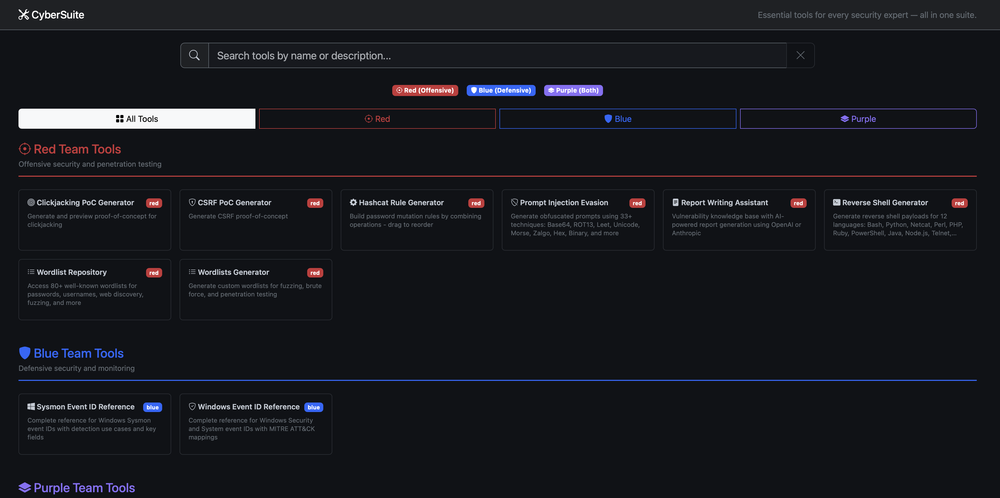

# 🧰 Cybersuite — Security Resource Hub

[](./res)
[](https://tailwindcss.com)
[](https://developer.mozilla.org/en-US/docs/Web/JavaScript)

> ⚠️ **Disclaimer**
>
> **Cybersuite is for educational and authorized security work only.**
> - Use these resources only on systems you have explicit permission to test
> - The author is not responsible for misuse

## 🎯 What is Cybersuite?

Cybersuite is a curated, searchable hub of security tools, frameworks, and references. It turns a large resource list into a clean, fast browsing experience with filtering, pinning, and rich detail views.

 

## ✨ Key Features

- **🔎 Instant search** - Live search with autosuggest-style placeholder hints
- **📌 Pinning** - Keep your most used tools at the top (stored locally)
- **❤️ Likes counter** - Community signal backed by CountAPI
- **🧾 Detail view** - Rich markdown cards with more details about a specific resource
- **➕ Request Integration** - Built-in form to propose new tools
- **🧱 Zero build step** - Plain HTML/CSS/JS, just open and go

## 🚀 Quick Start

```bash
# Clone the repository
# (replace with your repo URL)

git clone https://github.com/your-org/cybersuite.git
cd cybersuite

# Open directly
open index.html
```

## 📖 How to Use

1. **Search or filter** by category (Red, Blue, Purple, Utilities).
2. **Open a card** to read the detailed markdown notes.
3. **Pin** frequently used tools so they stay on top.
4. **Like** resources to surface community favorites.
5. **Request a tool** directly from the modal.

## 🧩 Project Structure

```
cybersuite/
├── index.html          # Main HTML page
├── styles.css          # Styling and theme
├── app.js              # Rendering, filtering, and UI logic
├── resources.js        # Aggregates resource lists
├── res/                # Resource data + type icons
│   ├── red.js
│   ├── blue.js
│   ├── purple.js
│   ├── utils.js
│   └── types.js
└── assets/             # Screenshots
```

## ⚙️ Configuration Notes

- **Likes counter** uses CountAPI (`app.js`). Swap the endpoint if you want your own namespace.
- **Request form** uses Web3Forms (`index.html`). Replace the `access_key` with your own for production.

## 🤝 Contributing

Contributions are welcome. A few good ways to help:

- Add new tools or improve descriptions in `res/*.js`
- Improve UI/UX in `index.html` or `styles.css`
- Fix bugs and polish the filtering, pinning, or modal workflows

If you open a PR, include:
- A clear description of the change
- Screenshots for UI changes
- Notes on testing (browser + steps)

## 📜 License

This project is licensed under the **MIT License**. See [`LICENSE`](LICENSE) for details.

## ⚖️ Ethical Use

Use this project only for authorized security testing and research. Always follow applicable laws, scope constraints, and rules of engagement.

---

<div align="center">

Made with ❤️ by [Giuseppe Toscano](https://gtoscano.me)

[⭐ Star on GitHub](https://github.com/0x8e5afe/cybersuite)

</div>
