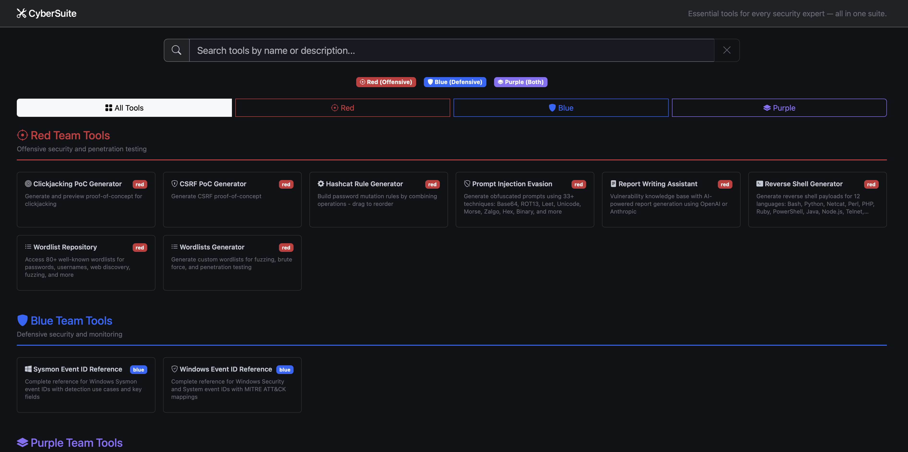

# 🛠️ CyberSuite 

[](https://opensource.org/licenses/MIT)
[](https://getbootstrap.com)
[](https://github.com/0x8e5afe/cybersuite)

> ⚠️ **Disclaimer**
>
> **CyberSuite is for educational and authorized security testing only.**
> - Only use on systems you own or have explicit permission to test  
> - Unauthorized access to computer systems is illegal  
> - Authors are not responsible for misuse  

---

## 🎯 What is CyberSuite?

CyberSuite is a **modular, browser-based security toolbox** for red, blue, and purple teams.  
Clone the repo, open `index.html` in a browser, and you immediately get a curated collection of **23 focused tools** for cybersecurity tasks.

Everything runs **completely client-side**: no backend, no external dependency chain, and nothing is sent to a server. 

 

---

### ✨ Key Features

- **🚀 Zero Installation**: Pure HTML/CSS/JS – runs in any modern browser  
- **🎨 Bootstrap Dark Theme**: Professional UI with responsive design  
- **⚡ Lightning Fast**: No backend, no dependencies, pure client-side  
- **🔒 Privacy First**: All processing happens locally  
- **🧩 Modular Architecture**: Easy to extend with new tools  
- **📱 Mobile Friendly**: Works on desktop, tablet, and mobile  

---

## 🧰 Tools Overview

CyberSuite ships with 22 tools, grouped by **Red**, **Blue**, and **Purple** team usage.  
Below is a brief overview (see the individual tool UIs for details and options).

### 🔴 Red Team Tools

| Tool Name | Description |
|-----------|-------------|
| **Clickjacking PoC Generator** | Build and preview clickjacking proof-of-concept pages using iframes and visual overlays. |
| **CSRF PoC Generator** | Generate ready-to-use CSRF PoC forms (GET/POST) to test anti-CSRF protections. |
| **Hashcat Rule Generator** | Compose and reorder Hashcat rules interactively to create custom password mutation chains. |
| **Prompt Injection Evasion** | Generate obfuscated / transformed prompt strings (Base64, hex, binary, Zalgo, etc.) for testing LLM prompt filters and injection defenses. |
| **Report Writing Assistant** | Helper that helps pentester to write technical report sections (designed to work also with OpenAI / Anthropic or otherwise using internal knowledge base). |
| **Reverse Shell Generator** | Generate reverse shell one-liners for many interpreters and platforms (bash, PowerShell, Python, PHP, Java, Node.js, Netcat, Socat, AWK, and more). |
| **SQLi Payloads Generator** | Generate SQL injection payloads tailored for different DBMS engines and testing scenarios. |
| **Steganography Tool** | Hide and extract messages inside images using LSB-based steganography. |
| **Wordlists Generator** | Generate custom wordlists for fuzzing, brute force and targeted password attacks using patterns, mutations and combinations. |
| **Wordlist Repository** | Browse and fetch wordlists directly from the **SecLists** project on GitHub (passwords, usernames, discovery, fuzzing, etc.). |
| **XSS Payloads Generator** | Generate multiple XSS payloads (including filter-bypass variants) for web application testing and research. |

### 🟣 Purple Team Tools

| Tool Name | Description |
|-----------|-------------|
| **Comparer** | Compare strings, hashes, HTTP requests, snippets of code, etc.. |
| **CORS Misconfiguration Checker** | Test endpoints for permissive or unsafe CORS responses and highlight risky configurations. |
| **CVSS v3.1 Calculator** | Calculate CVSS v3.1 base/temporal/environmental scores from vulnerability characteristics. |
| **Encoder/Decoder** | Encode / decode using many formats: Base64, URL, HTML entities, Unicode, hex, ROT13, binary, Morse, and more. |
| **Encryption Tool** | Encrypt/decrypt text and files with multiple algorithms and modes, plus HMAC helpers for integrity checks. |
| **Hash Generator** | Compute and compare cryptographic hashes (MD5, SHA-1, SHA-256, SHA-512, etc.) for files and text. |
| **HTTP Security Headers** | Analyze HTTP response headers and detect missing or misconfigured security headers (CSP, HSTS, X-Frame-Options, etc.). |
| **JWT Tool** | Decode and inspect JSON Web Tokens, view header/payload, and experiment with signing / verification scenarios. |
| **OWASP Top 10 Explorer** | Explore OWASP Top 10 style categories (including Web, API, CI/CD, ML/LLM-related lists) with links to official material. |
| **Password Cracking Complexity** | Estimate password cracking time based on charset, length, keyspace size and attack speed. |
| **Password Generator** | Generate cryptographically-strong random passwords with configurable character sets and policies. |

### 🔵 Blue Team Tools

| Tool Name | Description |
|-----------|-------------|
| **Sysmon Event ID Reference** | Reference Sysmon event IDs with descriptions, typical use cases and important fields for detection engineering. |
| **Windows Event ID Reference** | Reference Windows Security / System event IDs, including high-value events and mappings to MITRE ATT&CK where relevant. |

---

## 🚀 Quick Start

### Option 1: Direct Usage (Simplest)

```bash
# Clone the repository
git clone https://github.com/0x8e5afe/cybersuite.git
cd cybersuite
```

Just open `index.html` in your favorite modern browser (Chrome, Edge, Firefox, etc.) and all tools will load locally.

### Option 2: Local Web Server (Recommended)

Serving the files over `http://localhost` is closer to real-world usage (and avoids some browser quirks around `file://`).

```bash
git clone https://github.com/0x8e5afe/cybersuite.git
cd cybersuite

# Using Python
python3 -m http.server 8000

# or using Node.js
npx serve .
```

Then open:

```text
http://localhost:8000/
```

---

## 🏗 Project Structure

CyberSuite is intentionally small and easy to reason about:

```text
cybersuite/
├── index.html              # Main HTML entry point (layout, tool containers)
├── styles.css              # Dark theme + layout styling (Bootstrap-based)
├── app.js                  # Core application, routing, and tool loader
├── assets/
│   └── screenshot.png      # UI screenshot for the README
└── tools/                  # Modular tools directory (each tool = 1 JS file)
    ├── tool_1.js
    ├── tool_2.js
    ├── tool_3.js
    ├── etc..
```

The loading flow is:

1. `index.html` loads Bootstrap, icons, `styles.css` and `app.js`  
2. `app.js` defines the core UI, categories, and `window.registerCyberSuiteTool`  
3. `app.js` dynamically loads every file listed in `const toolFiles = [...]`  
4. Each tool file registers itself with `registerCyberSuiteTool({ ... })` and provides its own UI and logic  

No bundler, no build step: everything is static.

---

## 🔧 Developing a New Tool

### 1. Tool Contract

Every tool is just **one JavaScript file** in the `tools/` directory that:

- defines a `render()` function returning an HTML string for its UI  
- defines an `init()` function that wires up event handlers and behavior  
- registers itself via:

```js
window.registerCyberSuiteTool({
  id: 'unique-tool-id',
  name: 'Human readable name',
  description: 'Short one-line description',
  icon: 'bi-some-bootstrap-icon',
  category: 'red' | 'blue' | 'purple',
  render,
  init
});
```

Constraints:

- `id` must be unique across all tools  
- `category` must be one of: `'red'`, `'blue'`, `'purple'`  
- `icon` should be a [Bootstrap Icons](https://icons.getbootstrap.com/) class (e.g. `bi-bug-fill`)  

### 2. “Hello World” Example Tool

Create a new file: **`tools/hello-world-tool.js`**:

```js
// ========================================
// HELLO WORLD TOOL
// Category: Purple Team (Example)
// ========================================

(function () {
    'use strict';

    // 1. UI renderer
    function render() {
        return `
            <div class="section-header">
                <h3 class="mb-1 d-flex align-items-center gap-2">
                    <i class="bi bi-emoji-smile"></i>
                    <span>Hello World</span>
                </h3>
                <p class="text-secondary mb-0">
                    Minimal example of a CyberSuite tool. Click the button to print a message.
                </p>
            </div>

            <div class="card">
                <div class="card-body">
                    <button id="helloWorldButton" class="btn btn-primary">
                        Say Hello
                    </button>
                    <p id="helloWorldOutput"
                       class="mt-3 fw-bold text-success"
                       aria-live="polite"></p>
                </div>
            </div>
        `;
    }

    // 2. Behavior / event wiring
    function init() {
        const button = document.getElementById('helloWorldButton');
        const output = document.getElementById('helloWorldOutput');

        if (!button || !output) {
            console.error('[HelloWorld] Elements not found – did the template render?');
            return;
        }

        button.addEventListener('click', () => {
            const now = new Date().toLocaleString();
            output.textContent = `Hello from CyberSuite! (${now})`;
        });
    }

    // 3. Tool registration
    window.registerCyberSuiteTool({
        id: 'hello-world',
        name: 'Hello World',
        description: 'Minimal example tool that prints a greeting',
        icon: 'bi-emoji-smile',
        category: 'purple',
        render,
        init
    });
})();
```

### 3. Add the Tool to `app.js`

Open **`app.js`** and locate the `const toolPaths = [...]` array.  
Add your new file to the list:

```js
const toolPaths = [
    'tools/clickjacking-poc-tool.js',
    'tools/cors-checker-tool.js',
    // ...
    'tools/wordlists-tool.js',
    'tools/hello-world-tool.js',   // ⬅️ New tool
];
```

Reload the page. You should see **Hello World** in the tool list, categorized under **Purple Team Tools**.

---

## 🤖 Example LLM Prompt to Generate a New Tool

CyberSuite plays nicely with LLMs like Claude / GPT.  
A practical workflow is:

1. Copy `index.html`, `styles.css`, `app.js` and one existing tool file (as a reference)  
2. Paste them into your LLM prompt  
3. Ask the LLM to create a new tool that follows the same registration pattern  

Below is an example prompt you can adapt:

```text
You are helping me extend a modular security toolkit called CyberSuite.

CyberSuite is a single-page web app that loads tools from the `tools/` directory.
Each tool is a standalone JavaScript file that calls `window.registerCyberSuiteTool({...})`
with this interface:

- id: unique tool id (string)
- name: human readable tool name
- description: one line summary
- icon: Bootstrap Icons class (e.g. "bi-bug-fill")
- category: "red" | "blue" | "purple"
- render(): returns HTML string for the tool's UI
- init(): wires up event handlers and behavior

I will paste four files as CONTEXT:
1) index.html
2) styles.css
2) app.js
3) one existing example tool file from tools/

Please READ them to understand the structure, CSS classes, and JavaScript utilities.

--- START index.html ---
[PASTE CONTENT OF index.html HERE]
--- END index.html ---

--- START styles.css ---
[PASTE CONTENT OF styles.css HERE]
--- END styles.css ---

--- START tools/example-tool.js ---
[PASTE CONTENT OF ONE EXISTING TOOL HERE, e.g. tools/encoder-decoder-tool.js]
--- END tools/example-tool.js ---

YOUR TASK:

1. Create a NEW tool file to be saved as:
   tools/my-new-tool.js

2. The new tool must:

   - Register itself with window.registerCyberSuiteTool({...})
   - Use a unique id (e.g. "my-new-tool")
   - Use category "purple"
   - Use a valid Bootstrap icon, e.g. "bi-lightning-charge"
   - Have a clear, concise name and description

3. Functionality for the new tool:

   - Purpose: [DESCRIBE WHAT YOU WANT, e.g. "HTTP request signer", "JWT cheat-sheet", etc.]
   - UI: use Bootstrap 5 card layout and form controls consistent with the existing tools
   - Accessibility: labels, aria attributes where reasonable
   - Implementation: pure client-side JavaScript, no external network calls except what is
     already allowed by the surrounding app (if needed)

4. Output ONLY the JavaScript code for tools/my-new-tool.js inside a single code block.

Do NOT modify index.html.
Do NOT change the registerCyberSuiteTool API.
Make sure render() and init() work together and there are no missing element IDs.

5. Only if needed, add also new lines of CSS code for styles.css
```

You can tweak the “Functionality for the new tool” section to generate different tools (e.g. another payload generator, a helper for detection engineering, etc.).

---

## 🤝 Contributing & Feedback

Contributions, ideas and bug reports are very welcome:

- 🐛 **Issues**: [GitHub Issues](https://github.com/0x8e5afe/cybersuite/issues)  
- 💬 **Discussions**: [GitHub Discussions](https://github.com/0x8e5afe/cybersuite/discussions)  
- ⭐ Consider starring the repo if you find CyberSuite useful  

### How to Contribute

1. Fork the repository
2. Create feature branch: `git checkout -b feature/amazing-tool`
3. Follow the tool development guide above
4. Test thoroughly
5. Commit: `git commit -m 'Add amazing tool'`
6. Push: `git push origin feature/amazing-tool`
7. Open a Pull Request

---

## 📜 License

This project is licensed under the **MIT License**. See [`LICENSE`](LICENSE) for details.

---

<div align="center">

Made with ❤️ by [Giuseppe Toscano](https://0x8e5afe.github.io/portfolio/)

[⭐ Star on GitHub](https://github.com/0x8e5afe/cybersuite)

</div>
